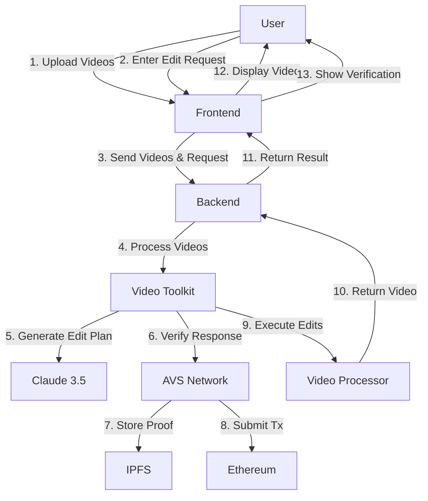

# Project Jarvis - AI Video Editor

A video editing application that uses AI to process natural language editing requests and verifies LLM responses on-chain using Hyperbolic's Agent Kit.

## Architecture



## Prerequisites

- Node.js 18+
- Python 3.11+
- Poetry
- Docker and Docker Compose
- Anthropic API Key (for Claude)

## Setup

1. Clone the repository:
```bash
git clone https://github.com/yourusername/Project-Jarvis.git
cd Project-Jarvis
```

2. Install Python dependencies:
```bash
poetry install
```

3. Install frontend dependencies:
```bash
cd frontend
npm install
```

4. Set up environment variables:
```bash
# In project root
cp .env.example .env
# Add your Anthropic API key to .env

# In llm_inference_verifier directory
cp .env.example .env
# Add your Alchemy API key to .env
```

## Running the Application

1. Start the LLM Verification Services:
```bash
cd llm_inference_verifier
docker-compose up -d
```

2. Start the Backend Server:
```bash
# In project root
poetry run python -m uvicorn api.main:app --reload --port 8000
```

3. Start the Frontend Development Server:
```bash
# In frontend directory
npm run dev
```

4. Access the application:
- Frontend: http://localhost:3001
- Backend API: http://localhost:8000

## Usage

1. Upload one or more video files (supported formats: MP4, MOV, AVI)
2. Enter your editing request in natural language (e.g., "make these split screen videos")
3. Click "Process Video" to start the editing process
4. Once complete, you can:
   - View the processed video
   - Check the on-chain verification details
   - Download the result

## Architecture Details

- **Frontend**: Next.js application with modern UI components
  - Modern UI built with Radix UI and Tailwind
  - Real-time video processing status updates
  - Seamless video upload and preview
  - Verification status display with Etherscan links

- **Backend**: FastAPI server handling video processing and LLM interactions
  - Asynchronous video processing pipeline
  - Integration with Claude 3.5 for natural language understanding
  - File management for video uploads and processed results
  - Error handling and status reporting

- **Video Toolkit**: Core processing engine using OpenCV and MoviePy
  - GPU-accelerated video processing
  - Support for multiple video formats
  - Split-screen and effects processing
  - Customizable video layouts and transitions

- **LLM Verification**: Autonomous Verification Service (AVS) powered by Othentic
  - Decentralized verification of LLM responses
  - Multi-attester consensus mechanism
  - Components:
    - Aggregator: Manages consensus and transaction submission
    - Attesters: Verify LLM responses independently
    - Validation Service: Validates response correctness
    - Execution Service: Handles transaction execution
  - Network Configuration:
    - Uses Sepolia testnet for verification
    - IPFS for storing proof data
    - P2P network for attester communication

- **Storage**:
  - Local file system for video processing
  - IPFS for verification proof storage
  - Ethereum blockchain for transaction records

## Environment Setup

### LLM Verification Environment

The LLM verification service uses Othentic's AVS framework. Follow these steps to set up the environment:

1. Set up operator keys:
```bash
AVS_GOVERNANCE_ADDRESS=
ATTESTATION_CENTER_ADDRESS=

PRIVATE_KEY_PERFORMER=
PRIVATE_KEY_AGGREGATOR=
PRIVATE_KEY_ATTESTER1=
PRIVATE_KEY_ATTESTER2=
PRIVATE_KEY_ATTESTER3=
PRIVATE_KEY_SYNCER=
PRIVATE_KEY_DEPLOYER=

PINATA_API_KEY=7824585a98fe36414d68
PINATA_SECRET_API_KEY=41a53a837879721969e73008d91180df30dbc66097c7f75f08cd5489176b43ea
IPFS_HOST=https://othentic.mypinata.cloud/ipfs/

OTHENTIC_BOOTSTRAP_ID=12D3KooWBNFG1QjuF3UKAKvqhdXcxh9iBmj88cM5eU2EK5Pa91KB
OTHENTIC_BOOTSTRAP_SEED=97a64de0fb18532d4ce56fb35b730aedec993032b533f783b04c9175d465d9bf
LLM_BEARER_TOKEN=
```


For detailed setup instructions and architecture details, refer to:
- [Othentic AVS Documentation](https://docs.othentic.xyz/getting-started)
- [Hyperbolic Agent Kit Documentation](https://github.com/hyperbolic-labs/agentkit)
- [Claude API Documentation](https://docs.anthropic.com/claude/reference/getting-started-with-the-api)
- [Sepolia Testnet](https://sepolia.dev/)
- [IPFS Documentation](https://docs.ipfs.tech/)

## References

- [Hyperbolic Agent Kit Documentation](https://github.com/hyperbolic-labs/agentkit)

## License

This project is licensed under the MIT License - see the [LICENSE](LICENSE) file for details.
